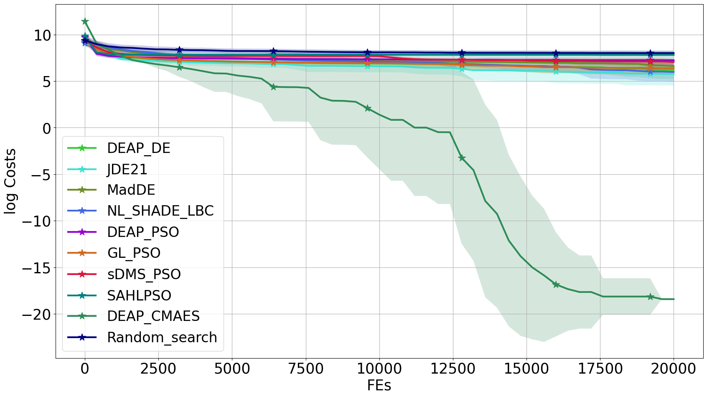
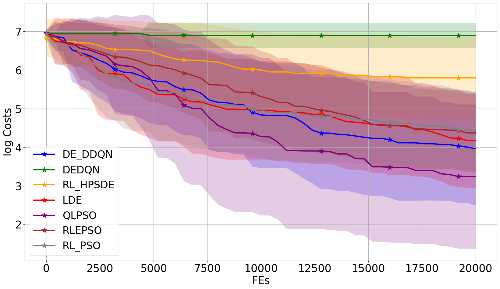
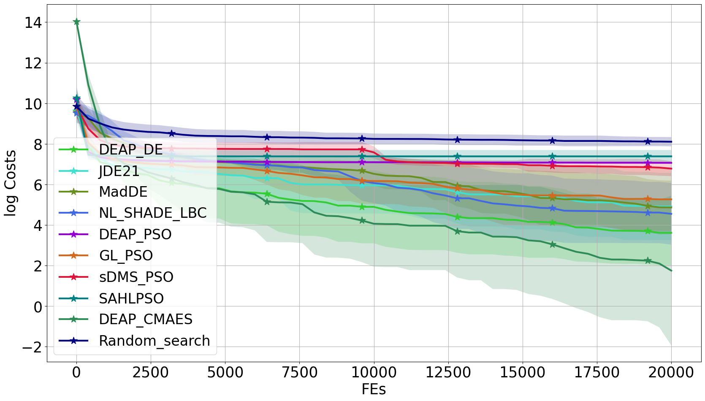
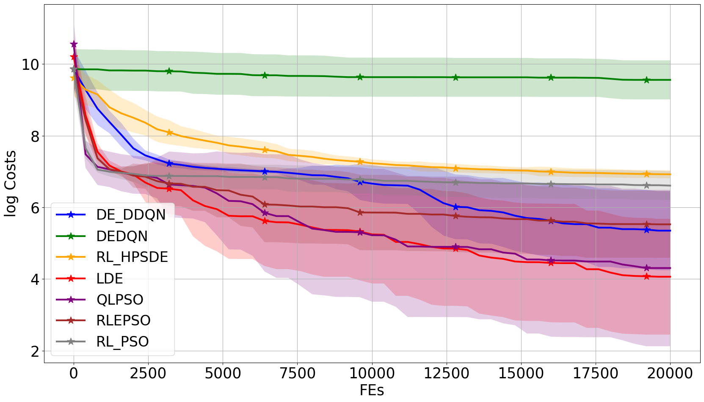
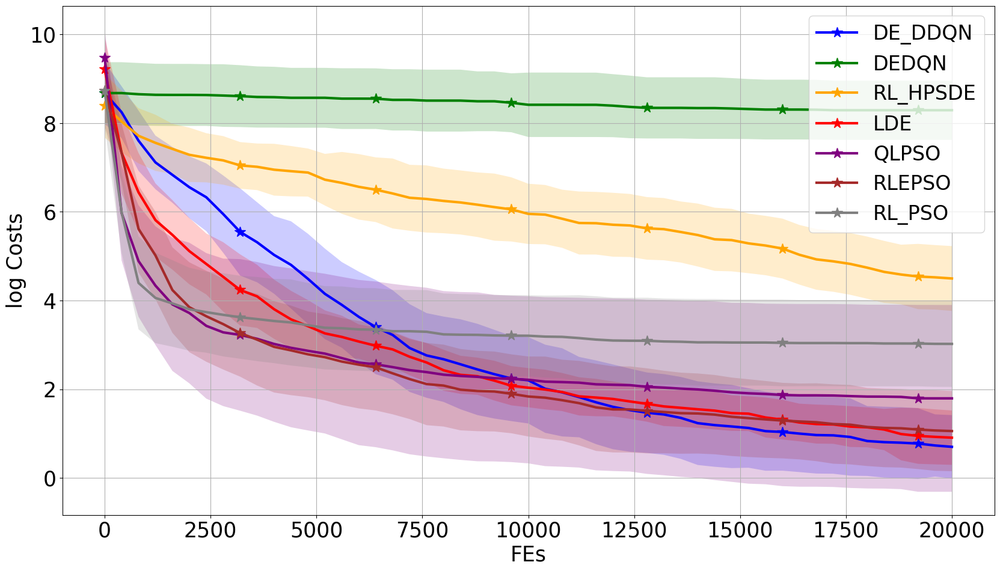
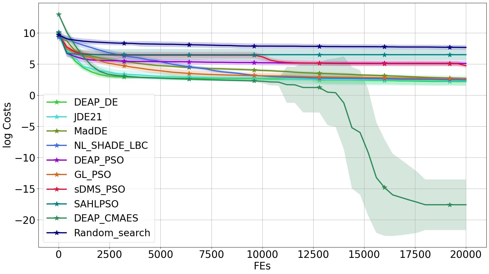
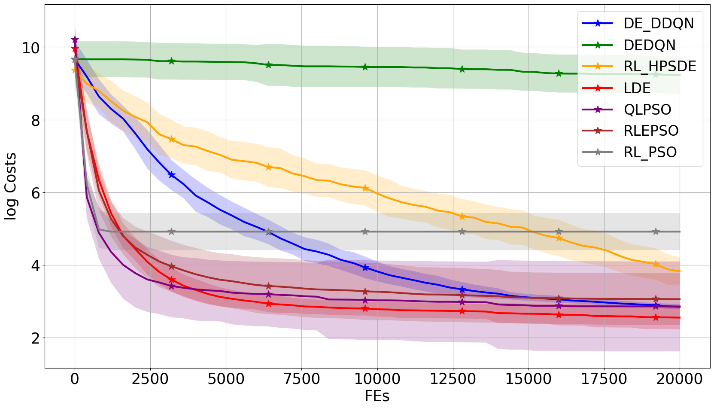
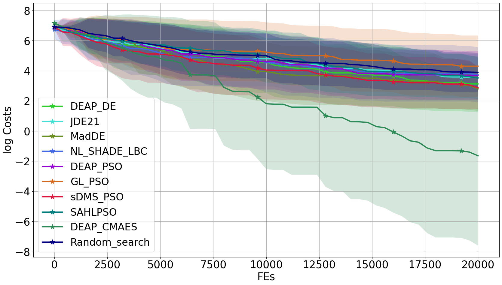
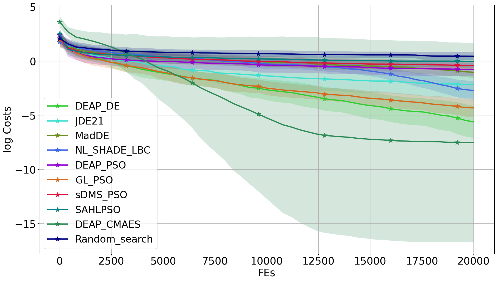
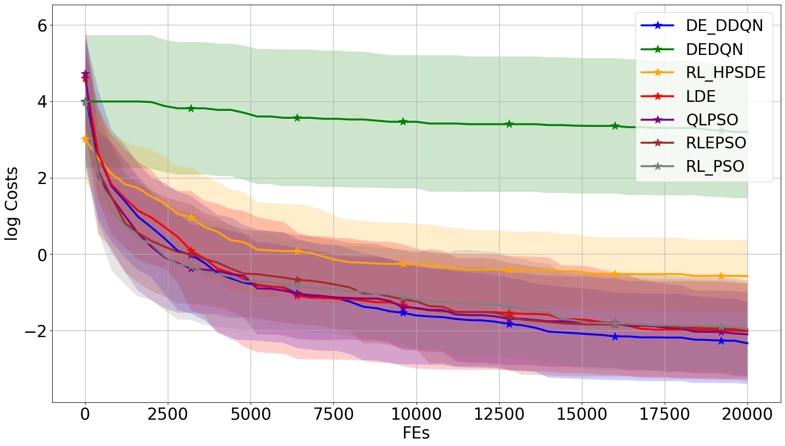

    

    all problem cost curves

<table>
​	<tr>
		<td>
			

				
			

			

				classic_Composite_Grie_rosen_cauchy
			

​		</td>
​		<td>
			

				
			

      

				learnable_Composite_Grie_rosen_cauchy
			

​		</td>
​		<td>
			

				
			

       

				classic_Composite_Grie_rosen_uniform
			

​		</td>
​		<td>
			

				
			

      

				learnable_Composite_Grie_rosen_uniform
			

​		</td>
​</tr>
​<tr>
    	<td>
	

		
	

        

		classic_Different_Powers_cauchy
	

​	</td>
​	<td>
	

		
	

        

		learnable_Different_Powers_cauchy
	

​	</td>
	<td>
	

		
	

        

		classic_Ellipsoidal_cauchy
	

​	</td>
​	<td>
	

		
	

        

		learnable_Ellipsoidal_cauchy
	

​	</td>
​</tr>
<tr>
    	<td>
	

		
	

        

		classic_Gallagher_101Peaks_cauchy
	

​	</td>
​	<td>
	

		
	

        

		learnable_Gallagher_101Peaks_cauchy
	

​	</td>
	<td>
	

		
	

        

		classic_Gallagher_101Peaks_gauss
	

​	</td>
​	<td>
	

		
	

        

		learnable_Gallagher_101Peaks_gauss
	

​	</td>
​</tr>
<tr>
    	<td>
	

		
	

        

		classic_Gallagher_101Peaks_uniform
	

​	</td>
​	<td>
	

		
	

        

		learnable_Gallagher_101Peaks_uniform
	

​	</td>
	<td>
	

		
	

        

		classic_Rosenbrock_cauchy
	

​	</td>
​	<td>
	

		
	

        

		learnable_Rosenbrock_cauchy
	

​	</td>
​</tr>
<tr>
    	<td>
	

		
	

        

		classic_Rosenbrock_gauss
	

​	</td>
​	<td>
	

		
	

        

		learnable_Rosenbrock_gauss
	

​	</td>
	<td>
	

		
	

        

		classic_Rosenbrock_moderate_cauchy
	

​	</td>
​	<td>
	

		
	

        

		learnable_Rosenbrock_moderate_cauchy
	

​	</td>
​</tr>
<tr>
    	<td>
	

		
	

        

		classic_Rosenbrock_moderate_gauss
	

​	</td>
​	<td>
	

		
	

        

		learnable_Rosenbrock_moderate_gauss
	

​	</td>
	<td>
	

		
	

        

		classic_Rosenbrock_uniform
	

​	</td>
​	<td>
	

		
	

        

		learnable_Rosenbrock_uniform
	

​	</td>
​</tr>
<tr>
    	<td>
	

		
	

        

		classic_Schaffers_cauchy
	

​	</td>
​	<td>
	

		
	

        

		learnable_Schaffers_cauchy
	

​	</td>
	<td>
	

		
	

        

		classic_Schaffers_gauss
	

​	</td>
​	<td>
	

		
	

        

		learnable_Schaffers_gauss
	

​	</td>
​</tr>
<tr>
    	<td>
	

		
	

        

		classic_Schaffers_uniform
	

​	</td>
​	<td>
	

		
	

        

		learnable_Schaffers_uniform
	

​	</td>
	<td>
	

		
	

        

		classic_Sphere_cauchy
	

​	</td>
​	<td>
	

		
	

        

		learnable_Sphere_cauchy
	

​	</td>
​</tr>
<tr>
    	<td>
	

		
	

        

		classic_Sphere_gauss
	

​	</td>
​	<td>
	

		
	

        

		learnable_Sphere_gauss
	

​	</td>
	<td>
	

		
	

        

		classic_Sphere_moderate_cauchy
	

​	</td>
​	<td>
	

		
	

        

		learnable_Sphere_moderate_cauchy
	

​	</td>
​</tr>
<tr>
    	<td>
	

		
	

        

		classic_Sphere_moderate_uniform
	

​	</td>
​	<td>
	

		
	

        

		learnable_Sphere_moderate_uniform
	

​	</td>
	<td>
	

		
	

        

		classic_Sphere_uniform
	

​	</td>
​	<td>
	

		
	

        

		learnable_Sphere_uniform
	

​	</td>
​</tr>
<tr>
    	<td>
	

		
	

        

		classic_Step_Ellipsoidal_gauss
	

​	</td>
​	<td>
	

		
	

        

		learnable_Step_Ellipsoidal_gauss
	

​	</td>
	<td>
	

		
	

        

		classic_Step_Ellipsoidal_uniform
	

​	</td>
​	<td>
	

		
	

        

		learnable_Step_Ellipsoidal_uniform
	

​	</td>
​</tr>
</table>
