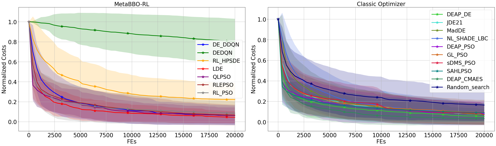
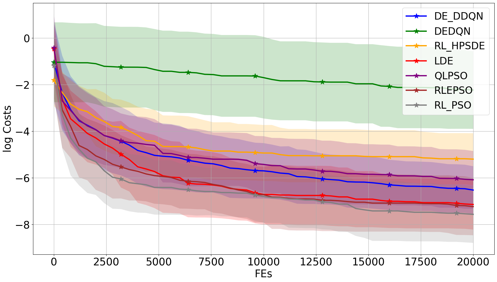
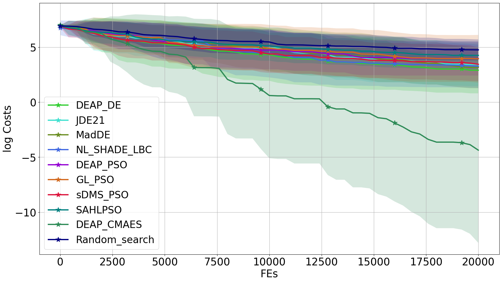
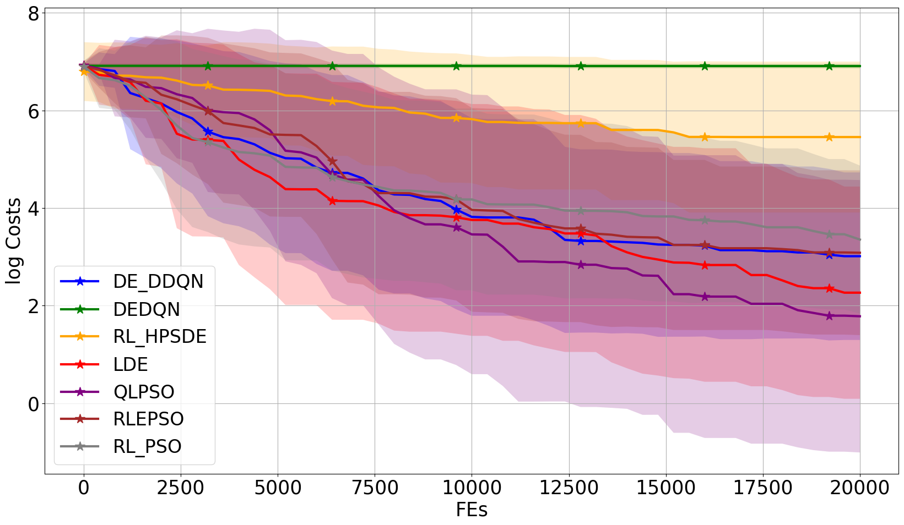

    

    caption

<table>
​	<tr>
		<td>
			

				
			

			

				classic_Composite_Grie_rosen_cauchy
			

​		</td>
​		<td>
			

				
			

      

				learnable_Composite_Grie_rosen_cauchy
			

​		</td>
​		<td>
			

				
			

       

				classic_Composite_Grie_rosen_uniform
			

​		</td>
​		<td>
			

				
			

      

				learnable_Composite_Grie_rosen_uniform
			

​		</td>
    <td>
			

				
			

       

				classic_Different_Powers_cauchy
			

​		</td>
​		<td>
			

				
			

      

				learnable_Different_Powers_cauchy
			

​		</td>
​	</tr>
</table>
