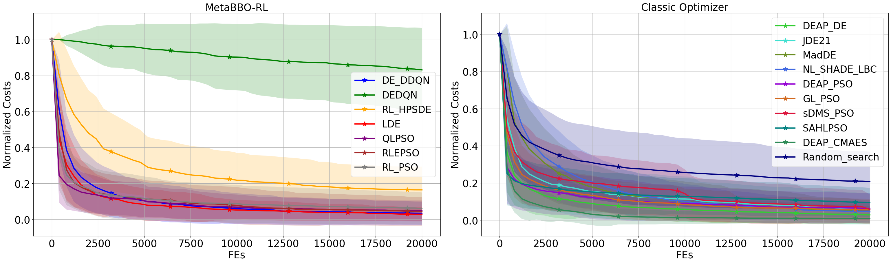
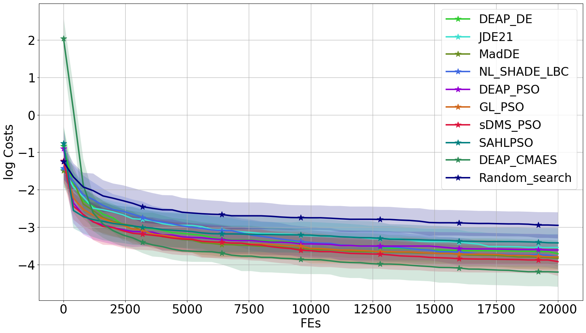
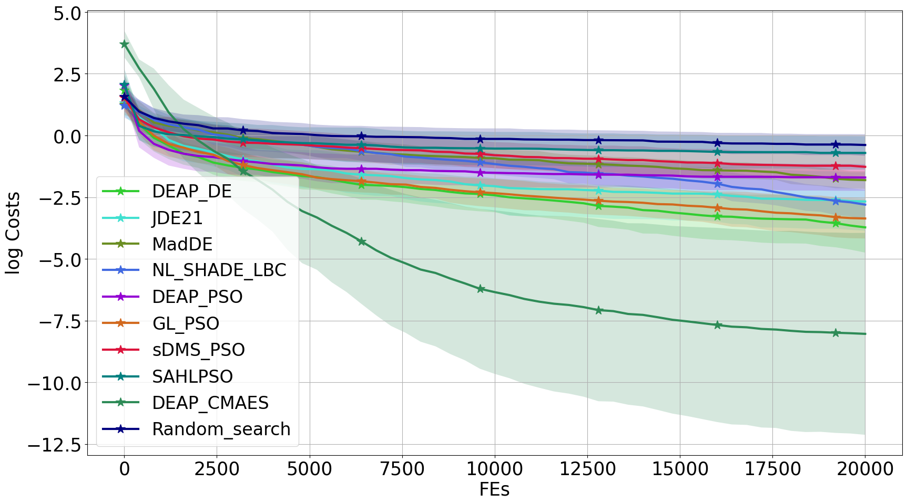
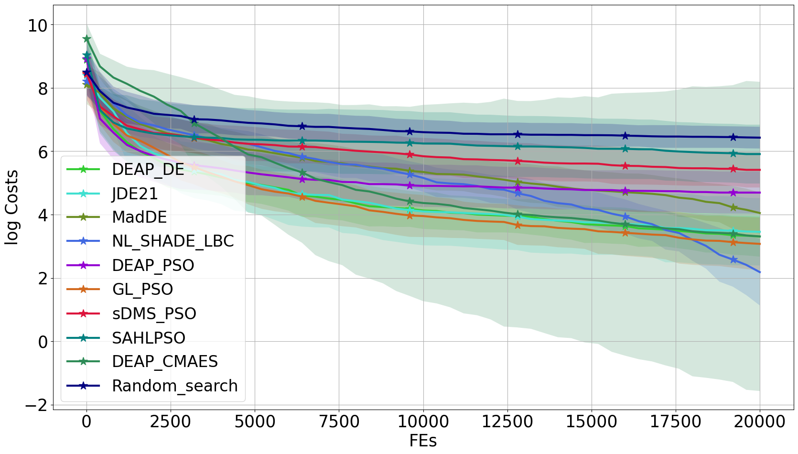
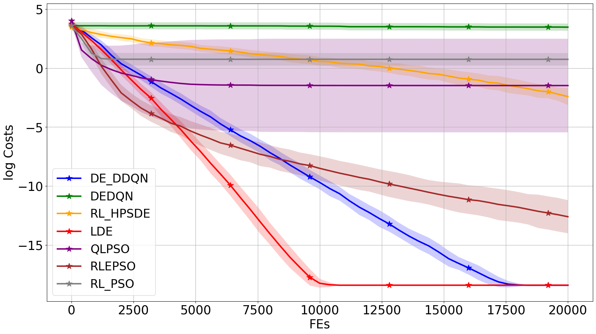

	

		All problem cost curves

<table>
	<tr>
		<td>
			

				
			

			

				classic_Composite_Grie_rosen_gauss
			

		</td>
		<td>
			

				
			

			

				learnable_Composite_Grie_rosen_gauss
			

		</td>
		<td>
			

				
			

            

				classic_Different_Powers_gauss
			

		</td>
		<td>
			

				
			

            

				learnable_Different_Powers_gauss
			

		</td>
	</tr>
	<tr>
		<td>
			

				
			

			

				classic_Different_Powers_uniform
			

		</td>
		<td>
			

				
			

			

				learnable_Different_Powers_uniform
			

		</td>
		<td>
			

				
			

			

				classic_Ellipsoidal_gauss
			

		</td>
		<td>
			

				
			

			

				learnable_Ellipsoidal_gauss
			

		</td>
	</tr>
	<tr>
		<td>
			

				
			

			

				classic_Ellipsoidal_uniform
			

		</td>
		<td>
			

				
			

			

				learnable_Ellipsoidal_uniform
			

		</td>
		<td>
			

				
			

			

				classic_Rosenbrock_moderate_uniform
			

		</td>
		<td>
			

				
			

			

				learnable_Rosenbrock_moderate_uniform
			

		</td>
	</tr>
	<tr>
		<td>
			

				
			

			

				classic_Sphere_moderate_gauss
			

		</td>
		<td>
			

				
			

			

				learnable_Sphere_moderate_gauss
			

		</td>
		<td>
			

				
			

			

				classic_Step_Ellipsoidal_cauchy
			

		</td>
		<td>
			

				
			

			

				learnable_Step_Ellipsoidal_cauchy
			

		</td>
	</tr>

</table>
