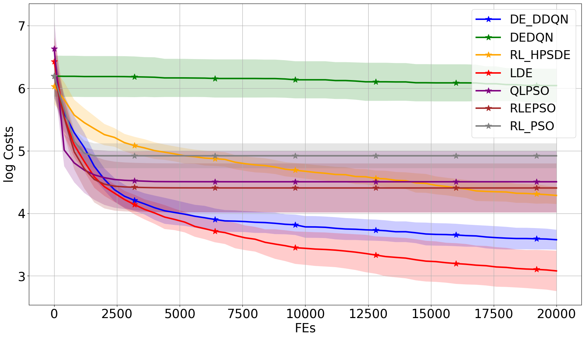
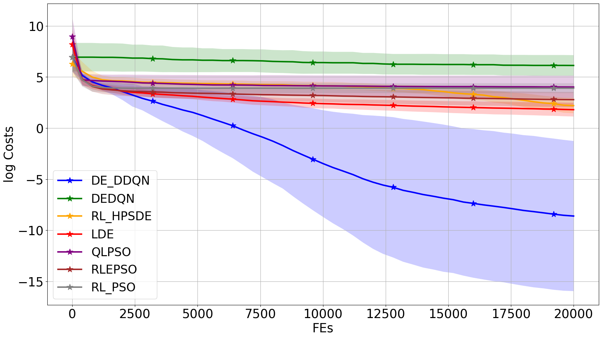
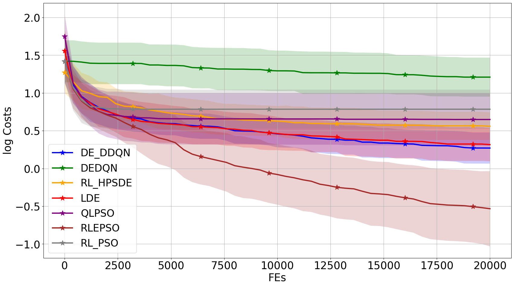
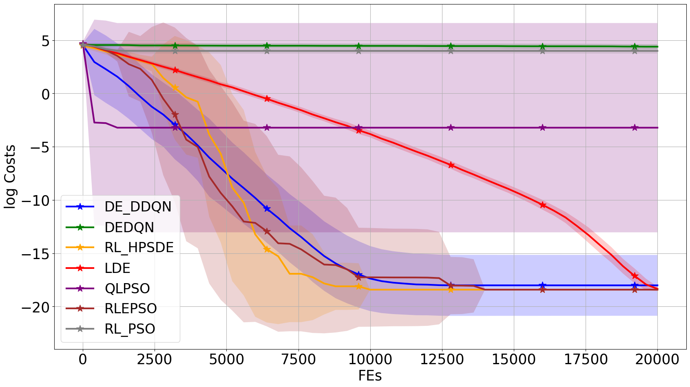
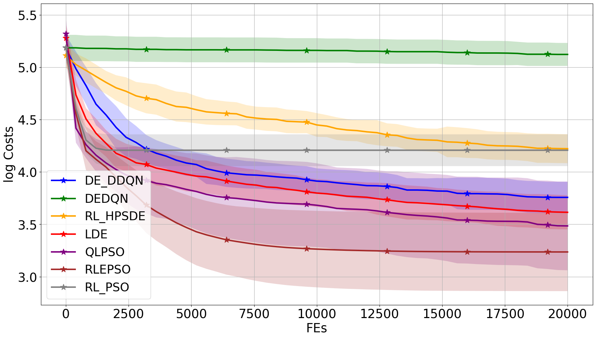
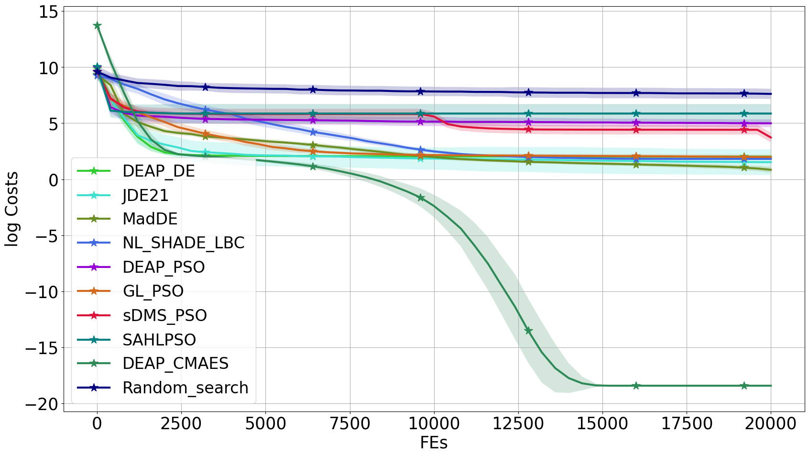
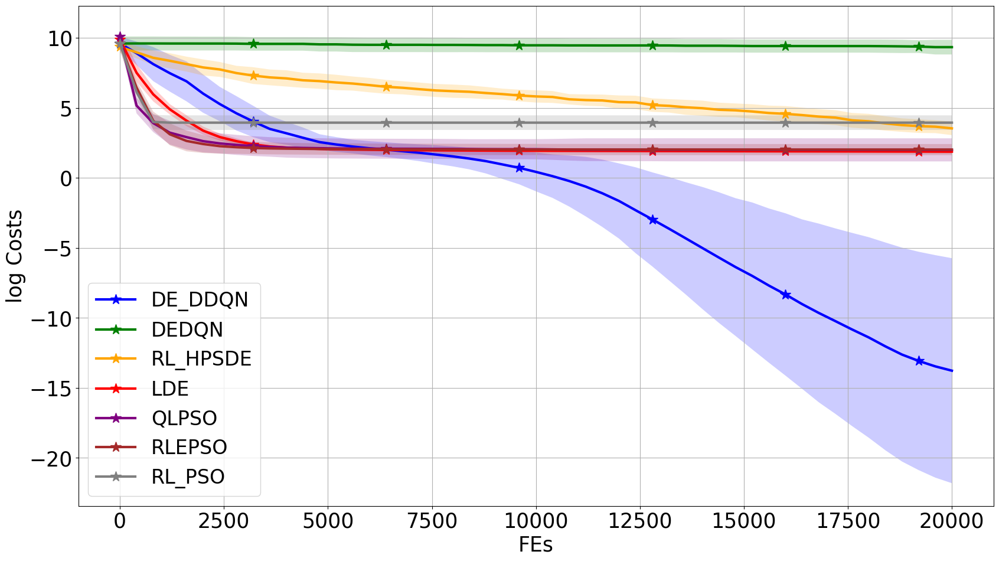
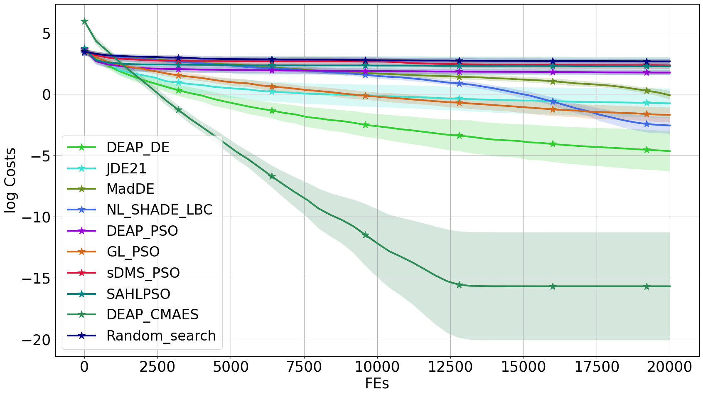
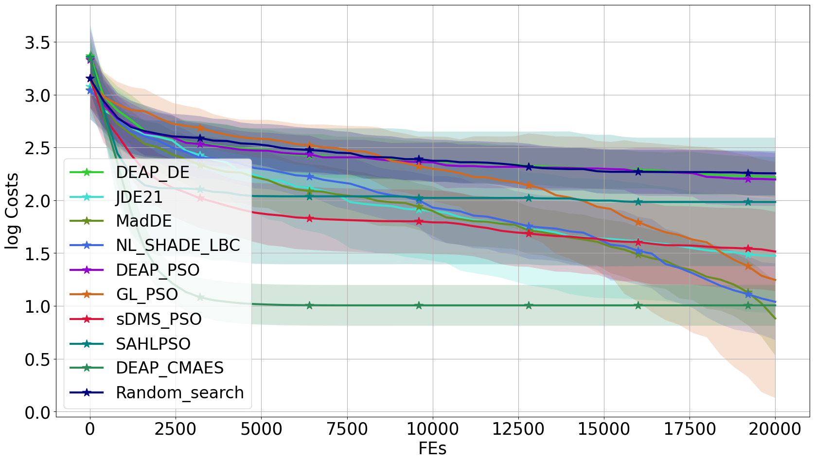

		Average cost curve over all problems
	

	
	

	
<table>
	<caption align="center">Cost curve for each problem</caption> 
​	<tr>
		<td>
			

				
			

			

				classic_Bent_Cigar
			

​		</td>
​		<td>
			

				
			

	                

				learnable_Bent_Cigar
			

​		</td>
​		<td>
			

				
			

	                

				classic_Buche_Rastrigin
			

​		</td>
​		<td>
			

				
			

	                

				learnable_Buche_Rastrigin
			

​		</td>
	        <td>
			

				
			

	                

				classic_Different_Powers
			

​		</td>
​		<td>
			

				
			

	                

				learnable_Different_Powers
			

​		</td>
​	</tr>
	<tr>
		<td>
			

				
			

			

				classic_Discus
			

​		</td>
​		<td>
			

				
			

	                

				learnable_Discus
			

​		</td>
​		<td>
			

				
			

	                

				classic_Ellipsoidal_high_cond
			

​		</td>
​		<td>
			

				
			

	                

				learnable_Ellipsoidal_high_cond
			

​		</td>
	        <td>
			

				
			

	                

				classic_Gallagher_21Peaks
			

​		</td>
​		<td>
			

				
			

	                

				learnable_Gallagher_21Peaks
			

​		</td>
​	</tr>
	<tr>
		<td>
			

				
			

			

				classic_Katsuura
			

​		</td>
​		<td>
			

				
			

	                

				learnable_Katsuura
			

​		</td>
​		<td>
			

				
			

	                

				classic_Linear_Slope
			

​		</td>
​		<td>
			

				
			

	                

				learnable_Linear_Slope
			

​		</td>
	        <td>
			

				
			

	                

				classic_Lunacek_bi_Rastrigin
			

​		</td>
​		<td>
			

				
			

	                

				learnable_Lunacek_bi_Rastrigin
			

​		</td>
​	</tr>
	<tr>
		<td>
			

				
			

			

				classic_Rastrigin_F15
			

​		</td>
​		<td>
			

				
			

	                

				learnable_Rastrigin_F15
			

​		</td>
​		<td>
			

				
			

	                

				classic_Rastrigin
			

​		</td>
​		<td>
			

				
			

	                

				learnable_Rastrigin
			

​		</td>
	        <td>
			

				
			

	                

				classic_Rosenbrock_original
			

​		</td>
​		<td>
			

				
			

	                

				learnable_Rosenbrock_original
			

​		</td>
​	</tr>
	<tr>
		<td>
			

				
			

			

				classic_Rosenbrock_rotated
			

​		</td>
​		<td>
			

				
			

	                

				learnable_Rosenbrock_rotated
			

​		</td>
​		<td>
			

				
			

	                

				classic_Schaffers_high_cond
			

​		</td>
​		<td>
			

				
			

	                

				learnable_Schaffers_high_cond
			

​		</td>
	        <td>
			

				
			

	                

				classic_Schaffers
			

​		</td>
​		<td>
			

				
			

	                

				learnable_Schaffers
			

​		</td>
​	</tr>
	<tr>
		<td>
			

				
			

			

				classic_Schwefel
			

​		</td>
​		<td>
			

				
			

	                

				learnable_Schwefel
			

​		</td>
​		<td>
			

				
			

	                

				classic_Sphere
			

​		</td>
​		<td>
			

				
			

	                

				learnable_Sphere
			

​		</td>
	        <td>
			

				
			

	                

				classic_Weierstrass
			

​		</td>
​		<td>
			

				
			

	                

				learnable_Weierstrass
			

​		</td>
​	</tr>
</table>
