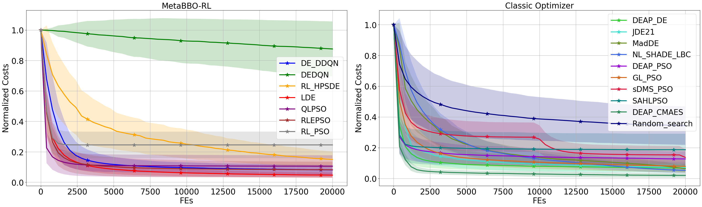
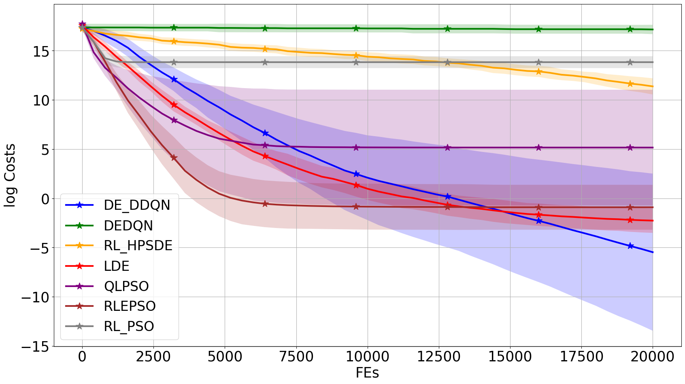

	
	

	

		All problem cost curves
	

<table>
​	<tr>
		<td>
			

				
			

			

				classic_Bent_Cigar
			

​		</td>
​		<td>
			

				
			

	                

				learnable_Bent_Cigar
			

​		</td>
​		<td>
			

				
			

	                

				classic_Bent_Cigar
			

​		</td>
​		<td>
			

				
			

	                

				learnable_Bent_Cigar
			

​		</td>
​	</tr>
</table>
